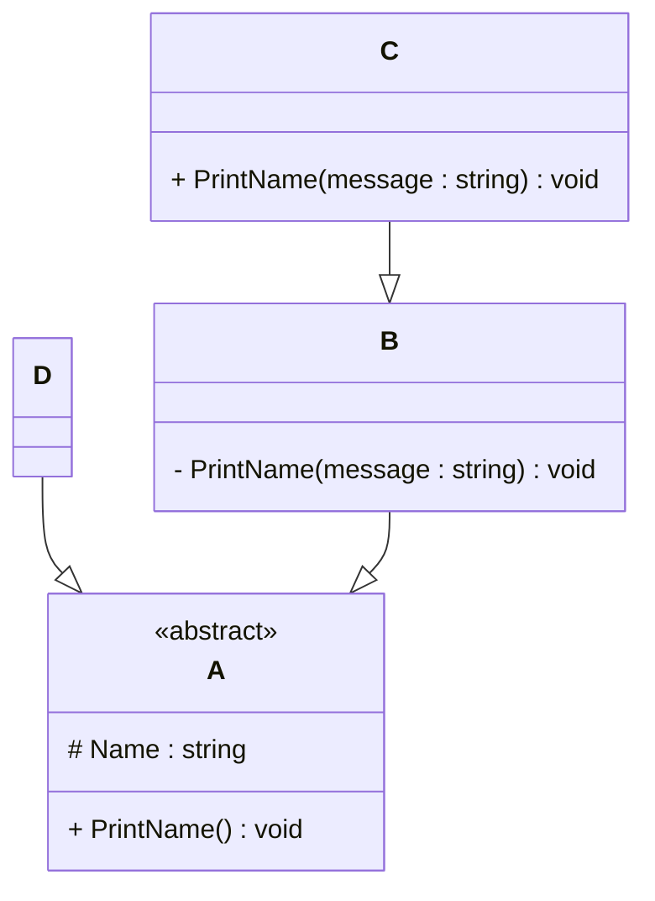

# Programming Test

This test was composed to create a general overview of your knowledge regarding general programming and how it fits with the needs in our lab. Please try to answer all questions using your own knowledge and in your own words. If you get stuck on one of the exercises, still try to give a short answer.

---

## Exercise 1

### Task

Write a program in the language of your choice where:

1. The iteration number (starting from 1), followed by a random number between 1 and 100, is printed 100 times.
2. After every 5 iterations, write an additional separator (e.g., `---`).
3. Write “Lucky number!” after every random number that is divisible by 7.

> Try to keep the procedure as short as possible.

```
   for (let i = 1; i <= 100; i++) {
      const randomNum = Math.floor(Math.random() * 100) + 1;
      console.log(
         `(${i}): ${randomNum}` + (randomNum % 7 === 0 ? " Lucky number!" : "")
      );
      if (i % 5 === 0) console.log("---");
   }
```

## Exercise 2

### 1. **What is your understanding of the term “Design Patterns”?**

Provide a description in your own words.

Design patterns are common solutions to recurring problems in software design. They offer a way to organize code in a reusable and efficient manner, making development easier and more structured. Each pattern provides a standard approach to solving a particular problem, but it can be adapted to fit the specific need of the project.
For example, some patterns help create objects without exposing the creation logic, or ensure that only one instance of a class exists globally.

### 2. **Explain the MVC Pattern**

- What does MVC stand for?

  MVC stands for Model-View-Controller.

- Explain the pattern in detail.

  It's an architectural pattern that separates an application into three main components:
  - Model: Manages the data and business logic. It represents the structure of the database and handles communication with it.
  - View: Responsible for displaying data to the user and collecting user input. It reflects the model and UI logic.
  - Controller: Acts as a mediator between the model and the view. It processes user input from the view, updates the model, and refreshes the view accordingly.

- What are some use cases for this framework?

  It's widely used in web frameworks such as Laravel, ASP.NET MVC, Django, Ruby on Rails, and in desktop/mobile applications for better separation of concerns.

MVC stands for Model-View-Controller.

### 3. **List three other design patterns**

- Provide names and details for three additional design patterns.
- Explain how you have used those patterns in the past and how they have solved your problem
- Use diagrams to explain the design patterns.

  Factory: Creates objects without specifying the exact class to instantiate. In a purchase request system, I had to send different emails when a request changed state (e.g., approved, rejected, under review). Instead of many if statements, I created a factory that returns the correct email handler based on the status.
  Benefits:
  • Cleaner, more maintainable code.
  • Easy to add new states.

   The Factory selects the correct email handler based on request state:

  ```mermaid
  classDiagram

  class EmailHandler {
  <<interface>>
  +sendEmail()
  }

  class ApprovedEmailHandler {
  +sendEmail()
  }

  class RejectedEmailHandler {
  +sendEmail()
  }

  class UnderReviewEmailHandler {
  +sendEmail()
  }

  class EmailFactory {
  +getHandler(status: string) EmailHandler
  }

  EmailFactory --> EmailHandler
  ApprovedEmailHandler ..|> EmailHandler
  RejectedEmailHandler ..|> EmailHandler
  UnderReviewEmailHandler ..|> EmailHandler
  ```

  Dependency Injection: Decouples components and improves testability. I used it in a system that logs production variables like temperature, speed, and pressure. I used Dependency Injection to decouple the data logging logic from the storage layer, allowing me to switch between a real database or a simulated storage (e.g., for tests or offline mode).

  ```mermaid
  classDiagram

  class LoggerService {
  +log(data: string)
  }

  class RealStorage {
  +save(data: string)
  }

  class MockStorage {
  +save(data: string)
  }

  class ProductionMonitor {
  -storage: IStorage
  +recordData()
  }

  class IStorage {
  <<interface>>
  +save(data: string)
  }

  RealStorage ..|> IStorage
  MockStorage ..|> IStorage
  ProductionMonitor --> IStorage
  ProductionMonitor --> LoggerService

  ```

  Singleton: Ensures a class has only one instance with a global point of access. I used it in a logging system to ensure all parts of my application used the same logger instance. This prevented file conflicts and allowed central configuration for all logs.

  ```mermaid
  classDiagram

  class Logger {
  -instance : Logger
  -Logger()
  +getInstance() Logger
  +log(message: string)
  }

  Logger --> Logger : static getInstance()
  ```

---

## Exercise 3

### 1. **Implementation Task**

Based on the class diagram below, provide an implementation in any object-oriented programming language of your choice.



### 2. **Key Questions**

- Are you able to directly create a new instance of `ObjectA`? Please explain your answer.

  No, A is marked as abstract, so it cannot be instantiated directly. It must be inherited by a subclass, which can then be instantiated.

- Given an instance of `ObjectC`, are you able to call the method `PrintMessage` defined in `ObjectB`? Please explain your answer.

  Following the diagram design it’s not possible to call it directly, because a private method isn't accesible inside inherited clases, meaning it’s only accessible inside class B. To make the method accesible, it would have to be changed from private to protected

- Try to explain as many key features of object-oriented programming as you can find in this example.

  - Abstraction: A defines shared structure without concrete implementation.
  - Encapsulation: Uses private/protected/public to control access.
  - Inheritance: B and D inherit from A; C inherits from B.
  - Polymorphism: Subclasses define or override behavior.
  - Code reuse: Common behavior is inherited instead of repeated.

---

## Exercise 4

### Maintaining and Expanding Software for Component Validation

This exercise focuses on strategies for working with existing code bases and ensuring the software remains maintainable as new features and requirements are introduced.

### 1. **Working with Existing Code**

- How would you approach understanding and contributing to an existing code base with minimal disruption?

  I would first try to understand how the system works from the user's point of view, what the interfaces are, how components communicate, and what data is exchanged. Then I’d study the code structure, documentation, test coverage, requirements, and how to run it locally. I’d check recent pull requests, existing design patterns, and adopt the team's coding standards.

- What practices would you follow to ensure your changes integrate well with the current structure?

  To ensure my changes fit well, I’d follow the project’s coding standards, write tests if needed, and make small, clear commits. I’d also test my changes locally and request a code review before merging into the main repository.

### 2. **Ensuring Maintainability**

- What techniques would you use to keep the code base clean, modular, and easy to maintain as new features are added?

  I would use Domain-Driven Design to organize the code around real business concepts, making it easier to understand and change. It helps separate responsibilities and keeps each part of the system focused on what it should do. I would also use Test-Driven Development, writing tests before the code. This helps me design better, avoid bugs, and safely improve the code later.
  I also like to follow some standard guidelines for clean and maintainable code, such as the single responsibility principle, KISS, DRY, etc

- How would you handle code documentation and testing to support long-term maintainability?

  Documentation should explain what the system does, how to set it up, what tools it uses, and how to run tests. Keeping a shared changelog and recording key changes helps the team stay aligned and avoid confusion.
  Tests should be clear, focused, and not too tied to internal details. I'd use unit, integration, and regression tests, and follow Test-Driven Development when possible.

### 3. **Balancing Flexibility and Stability**

- How would you design or refactor the software to make it flexible for future changes while ensuring the existing functionality remains stable?

  I’d modularize the codebase, extract repetitive or tightly coupled parts into reusable components. Before refactoring sensitive code, I’d write tests to ensure nothing breaks. I’d analyze usage patterns to make future extensions safer and easier.

- Which design patterns or principles would you apply to achieve this balance

  I’d apply Test-Driven Development to keep things stable as the system grows, writing tests first helps me focus on what’s needed and catch issues early. To modernize legacy code, I’d use the Strangler Fig Pattern, replacing parts gradually instead of all at once, which makes changes safer. I’d also follow principles like Interface Segregation and Open/Closed, so the code stays modular, easy to extend, and doesn’t require constant rewrites.

---
